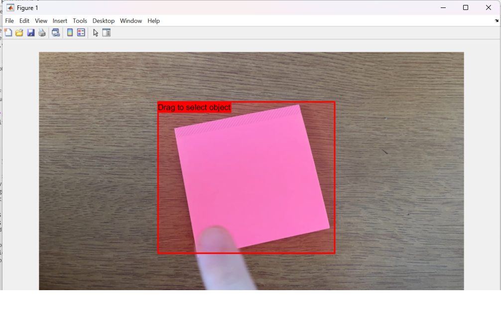

# Final_Project
CS435 - Mean Shift Tracking Final Project

Example 1:

Example 2:

To run the code, run main.m and follow the instructions to upload a video, select a bounding box, and it will then track the object frame by frame and when done export the video that will save in the local directory.